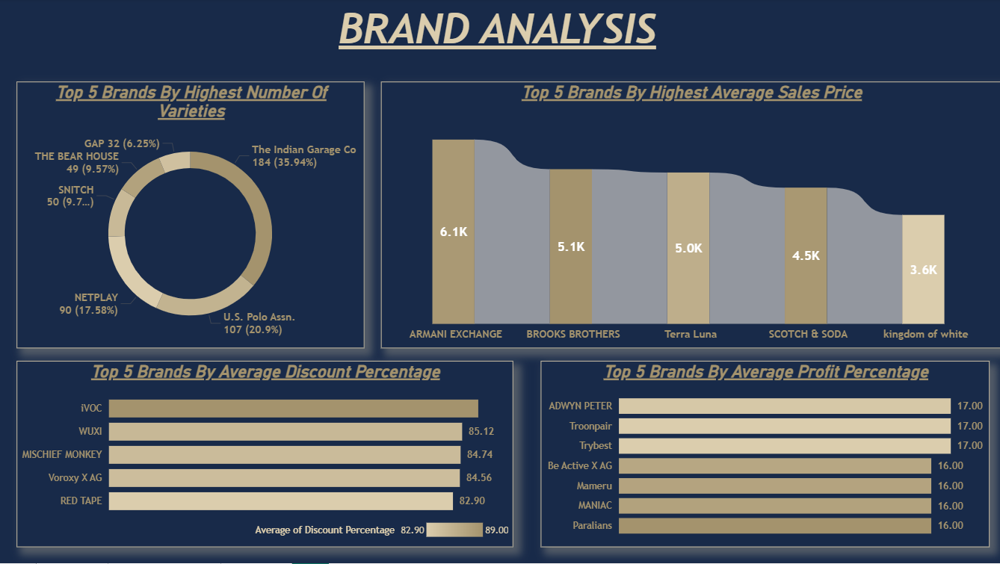

# Portfolio Project 3 – End-To-End Power BI Report (Datasource: Azure)

**Description:**  
This project is part of my professional portfolio, aimed at showcasing my expertise in working with different data sources and performing end-to-end data analysis. In this project, I demonstrate how to connect, clean, and analyze a real-world Men’s T-shirt dataset using **Azure SQL** and **Power BI**. The dataset was structured, cleaned, and analyzed to extract insights related to brand performance, pricing trends, discounts, and profitability, reflecting hands-on experience with cloud-based data management and business intelligence tools.

---

## 📂 Project Structure

- `01_Data/` – Contains the raw dataset file `Men_Tshirt.csv`.
- `02_PowerBI_Report/` – Contains the Power BI report file `Project.pbix`.
- `03_Resources/` – Contains the SQL script file `data_cleaning.sql` used for data cleaning and transformation.
- `04_Images/` – Contains visual summary images.  
  - `1.png`: Dashboard overview showing key brand metrics.
- `README.md` – Project documentation.

---

## ✅ Dataset Overview

- Product type: Men’s T-shirts  
- Dataset size: Approx. 1500 SKUs from various brands  
- Key columns: Brand, Original Price, Discount %, Profit %, etc.  
- Cleaning steps: Removed NULLs, blanks, trimmed spaces using SQL  
- Insights: Top brands by variations, pricing, discounts, and profitability

---

## ✅ Key Analyses

1. **Top 5 Brands by Highest Number of Varieties**  
2. **Top 5 Brands by Highest Average Sales Price**  
3. **Top 5 Brands by Average Discount Percentage**  
4. **Top 5 Brands by Average Profit Percentage**

These insights help businesses understand product diversity, pricing strategy, and profitability trends across brands.

---

## 🛠 Skills Used

- **Azure SQL** – Data cleaning, transformation, and management using cloud-based database  
- **Power BI** – Data modeling, visualization, and dashboard creation  
- **DAX (Data Analysis Expressions)** – Advanced calculations for deriving business insights  
- **Data Handling** – Working with real-world datasets and ensuring data quality  
- **Business Intelligence** – Extracting actionable insights for strategic decision making  

---

## 📸 Project Screenshot

---

## 🚀 How to Run

1. Import the dataset file from `01_Data/Men_Tshirt.csv` into Azure SQL.
2. Run the SQL cleaning script from `03_Resources/data_cleaning.sql` to clean and format the data.
3. Open the Power BI report file from `02_PowerBI_Report/Project.pbix` and connect it to the cleaned dataset.
4. Explore the dashboards and gain insights from the visualizations.

---

## ✍️ Author
**Gulbaaz**  
DTU’22 | Data & Business Analyst | SQL, Power BI, Excel Projects on GitHub  
📫 [GitHub Profile](https://github.com/Gulbaaz)
